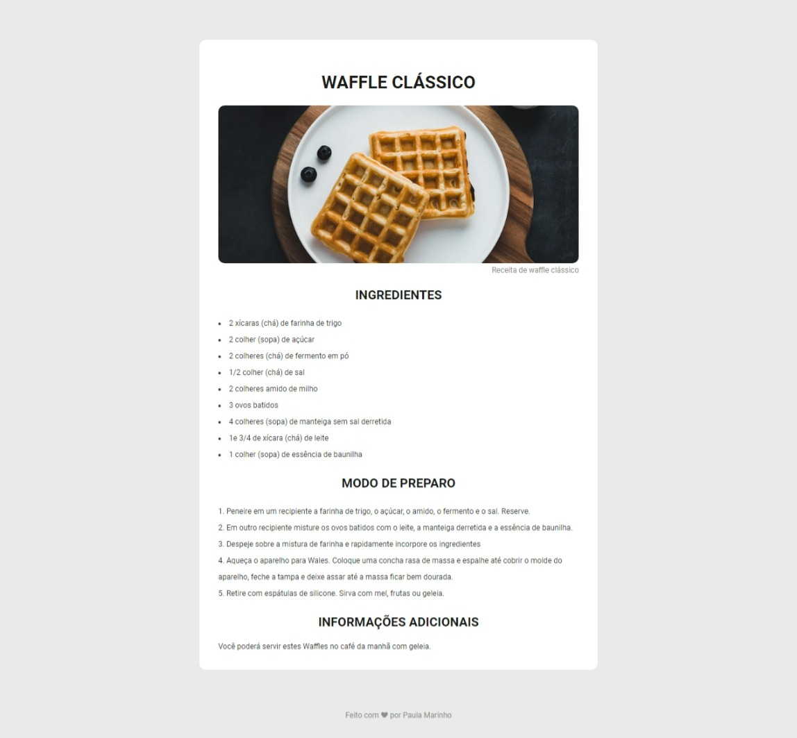

<h1 align="center"> Página de receitas </h1>

Reposítorio de uma página de receita

  <a href="#-tecnologias">Tecnologias</a>&nbsp;&nbsp;&nbsp;|&nbsp;&nbsp;&nbsp;
  <a href="#-projeto">Projeto</a>

 

  

## 🚀 Tecnologias

Esse projeto foi desenvolvido com as seguintes tecnologias:

- HTML
- CSS

## 💻 Projeto

Desafio da rocketseat para criar uma página web de uma receita com título, imagem, lista de ingredientes e modo de preparo.
Você pode ver o projeto [clicando aqui](https://paulaandrezza.github.io/Recipe-Page/).
